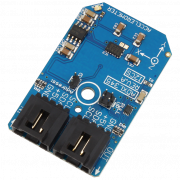

[](https://store.ncd.io/product/adxl345-3-axis-accelerometer-13-bit-i2c-mini-module/).

# ADXL345

Manufactured by Analog Devices, the ADXL345, is a low-power 3-axis accelerometer with high-resolution 13-bit measurement at up to ±16g.It measures the static acceleration of gravity in tilt-sensing applications, as well as dynamic acceleration resulting from motion or shock.Its high resolution (4 mg/LSB) enables measurement of inclination changes less than 1.0°. Several special sensing functions are provided. Activity and inactivity sensing detect the presence or lack of motion by comparing the acceleration on any axis with user-set thresholds.
This Device is available from www.ncd.io

[SKU: ADXL345]

(https://store.ncd.io/product/adxl345-3-axis-accelerometer-13-bit-i2c-mini-module/)
This Sample code can be used with Raspberry Pi.

Hardware needed to interface ADXL345 3Axis Accelometer With Raspberry Pi :

1. <a href="https://store.ncd.io/product/adxl345-3-axis-accelerometer-13-bit-i2c-mini-module/">ADXL345 3Axis Accelometer Sensor</a>

2. <a href="https://store.ncd.io/product/i2c-shield-for-raspberry-pi-3-pi2-with-outward-facing-i2c-port-terminates-over-hdmi-port/">Raspberry Pi I2C Shield</a>

3. <a href="https://store.ncd.io/product/i%C2%B2c-cable/">I2C Cable</a>

## Python

Download and install smbus library on Raspberry pi. Steps to install smbus are provided at:

https://pypi.python.org/pypi/smbus-cffi/0.5.1

Download (or git pull) the code in pi. Run the program.

```cpp
$> python ADXL345.py
```
The lib is a sample library, you will need to calibrate the sensor according to your application requirement.
